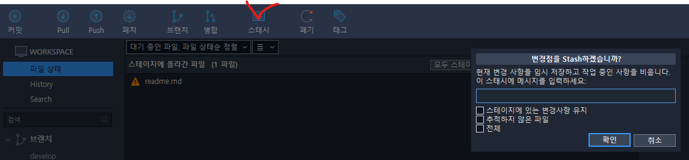
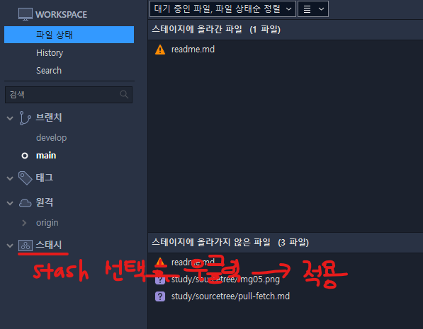

# Sourcetree - push & fetch
- pull (fetch + merge)
  1. 원격 저장소에서 변경내용을 가져옴 (fetch)
  2. 충돌이 없으면 로컬 브랜치에 merge 되어 변경내용이 적용됨
  3. 충돌이 있으면 해결 후 pull 가능
   (해결 예시)
   3-1. 로컬 변경내용을 stash 하여 임시 저장함
  
  3-2. pull
   3-3. 빼놓은 stash 다시 적용 
  

- fetch
  1. 원격 저장소의 커밋들을 로컬로 가져옴
  2. 커밋 히스토리 확인
  3. 이상 없으면 pull